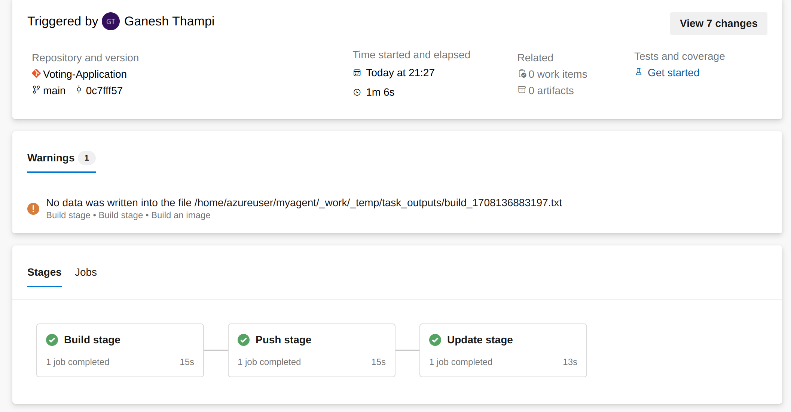

## Introduction
This project migrates a Multi Microservice Architectured application created by the Docker team from GitHub to Azure DevOps and implements Continuous Integration and Continuous Deployment (CI/CD) using Azure Pipelines and GitOps (Argo CD). The migration process will include setting up Azure DevOps repositories, configuring CI with Azure Pipelines, and establishing CD with GitOps using Argo CD on Azure Kubernetes Service (AKS).

## Microservices
The Voting Application consists of the following microservices:
- Python
- Node
- .NET

## App Architecture

* A front-end web app in [Python](/vote) which lets you vote between two options
* A [Redis](https://hub.docker.com/_/redis/) which collects new votes
* A [.NET](/worker/) worker which consumes votes and stores them in…
* A [Postgres](https://hub.docker.com/_/postgres/) database backed by a Docker volume
* A [Node.js](/result) web app that shows the results of the voting in real time

## CI/CD Architecture

## Continuous Integration (CI)
For CI, I utilized the following tools and technologies:
- Azure Repos for source code management
- Azure Pipelines for building, testing, and deploying the application
- Shell and Python scripts for automation tasks

## Continuous Deployment (CD)
For CD, I will implement GitOps using Argo CD for Kubernetes-based deployments on Azure Kubernetes Service (AKS).

## Migration Steps

1. **Setup Azure DevOps**
   - Create Azure DevOps organization and projects
   - Create repositories for each microservice
   - 
2. **Configure CI with Azure Pipelines**
   - Define build pipelines for Python, Node, and .NET microservices
   - Configure automated testing and quality checks
   - Integrate with Azure Repos for version control
     

  
     
3. **Implement CD with GitOps (Argo CD)**
   - Set up Argo CD on AKS cluster
   - Define application manifests for each microservice
   - Configure GitOps workflows for automated deployments
     

  
4. **Deploy to AKS**
   - Deploy the Voting Application to AKS using GitOps principles
   - Monitor deployments and application health

## Conclusion
Successfully migrated the Voting Application to Azure DevOps and established a robust CI/CD pipeline using Azure Pipelines and GitOps with Argo CD. This setup ensures efficient development workflows, automated testing, and reliable deployments on Azure Kubernetes Service.

## Screens

